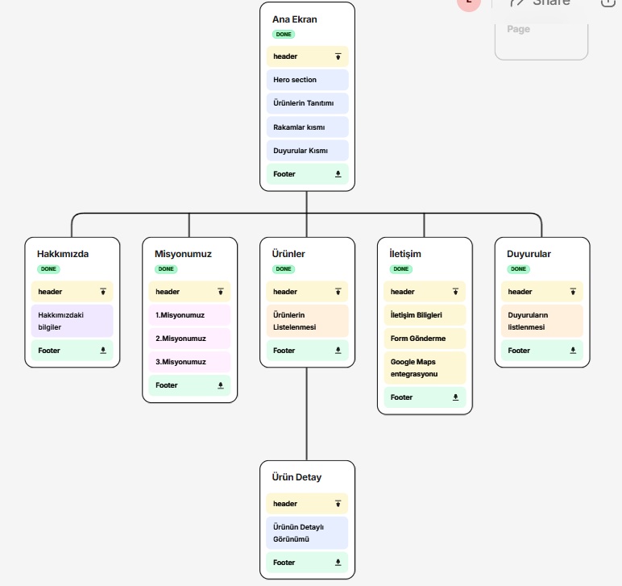

# Aronyam – Doğal Aronya Ürünleri E-Ticaret Sitesi

Aronyam, aronya meyvesi ve aronya bazlı ürünlerin tanıtımı için geliştirilmiş tamamen özgün, responsive bir web projesidir. Hazır template kullanılmadan **HTML, CSS ve JavaScript** kullanılarak sıfırdan tasarlanmıştır.

---

## Özellikler

### Özgün Tasarım
- Kendi tasarlanmış modern arayüz
- Mobil uyumlu 
- Hero alanı
- Sayaçlar, ürün kartları, özel bölümler

### JSON Tabanlı Ürün Sistemi
- `products.json` üzerinden ürün listeleme
- Ürün detay sayfasında dinamik veri gösterimi
- Ürün adı, fiyat, açıklama, stok ve görsel desteği

### Duyurular Sistemi
- `duyurular.json` üzerinden duyuru listeleme
- JSON canlı önizleme sistemi

###  Admin Paneli
- Duyuru ekleme
- Duyuru silme
- Ürün ekleme altyapısı
- JSON çıktısı görüntüleme

### Responsive Tasarım
- Tüm ekran boyutlarına uygun
- Flexbox & Grid yapısı
---

##  Kullanılan Teknolojiler

- **HTML5**
- **CSS3** (Flexbox, Grid)
- **JavaScript (Vanilla)**
- **JSON veri yönetimi**

---

##  Site Haritası (Sitemap)

Aşağıda Aronyam web sitesinin genel sayfa yapısı gösterilmektedir:

